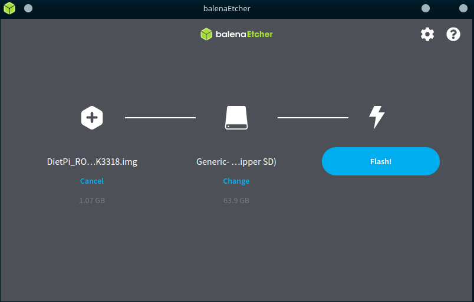

# Tu Propio Servidor Linux con una TV Box: Una Solución Ingeniosa

## Inspiración

Este proyecto nació con la intención de crear un servidor en casa. Muchos entusiastas de la tecnología, como yo, sueñan con tener su propio servidor doméstico. Sin embargo, un servidor profesional puede ser bastante costoso, lo que lleva a muchos a buscar alternativas como utilizar PC’s o laptops antiguas, o incluso una Raspberry Pi. En este tutorial, decidí explorar una opción menos común: reutilizar una TV box que ya no estaba en uso. La ventaja de este dispositivo es que está diseñado para permanecer encendido todo el día, cuenta con un puerto Ethernet, 4 GB de RAM, y es muy compacto.

## Objetivo

Para quienes poseen una TV box, sabrán que su sistema operativo es Android. El objetivo de este proyecto es aprovechar al máximo el hardware de la TV box instalando una versión de Linux server (en este caso, DietPi) y así transformarla en un servidor. Con este servidor, se pueden desarrollar muchos otros proyectos e incluso utilizarlo para alojar servicios propios.

## Requisitos:

- [**balenaEtcher**](https://www.balena.io/etcher)
- SD de al menos 16 GB (recomendable 32 GB)
- ISO de Dietpi (Importante checar la compatibilidad de tu procesador en mi caso es **RK3318)**
- Cable Ethernet
- Que la TV box tenga entrada Ethernet
- Que la laptop que vas a usar para instalar acepte tarjetas SD o tengas un adaptador
- Por cualquier cosa un maouse, teclado externo y un monitor.

## Recursos

- [https://www.balena.io/etcher](https://www.balena.io/etcher)
- [https://dietpi.com/#download](https://dietpi.com/#download)
- [https://dietpi.com/forum/t/dietpi-on-rk3328-rk3318-tvbox/15587/9](https://dietpi.com/forum/t/dietpi-on-rk3328-rk3318-tvbox/15587/9)
- [https://blog.desdelinux.net/dropbear-una-alternativa-ligera-a-openssh/](https://blog.desdelinux.net/dropbear-una-alternativa-ligera-a-openssh/)
- [https://www.putty.org](https://www.putty.org/)

## Tutorial

1. Primero es descargar la ISO o IMG de Dietpi, de acuerdo al procesador de tu TV box en mi caso es un **RK3318** 
2. Descargar e instalar BalenaEtcher
3. Antes de instalar Dietpi en la SD tienes que tener en cuenta que toda la informacion que tengas en la SD se va eliminar, una vez tengas en cuenta esto procedemos a insertar la SD en la laptop, abrimos BalenaEtcher y seleccionamos el IMG y presionamos el boton de FLASH. El proceso puede tardar, es importante que no se mueva ni desconecte la SD.
    
    
    
4. Antes de insertar la SD a la TV box es necesario verificar primero que nuestra TV box detecta perfectamente el Ethernet, para eso podemos conectar el cable de Ethernet de la TV box al router y verificar que el router detecta el uso del puerto Ethernet. Ejemplo si lo conectamos al puerto 1 Ethernet deberia de verse asi:
    
    
    
5. Vamos a colocar la SD dentro de la TV box y reiniciamos la TV box, se debe de **iniciar automáticamente** el instalador de Dietpi y al final se debe de poder ver un login, podemos ingresar con las credeciales root:dietpi, se debe de ver algo asi:
    
    
    
6. De  aquí en adelante, es la instalación normal de un Linux,solo te puedes mover con las flechas, primero te va a pedir configurar el teclado (si no sabes cual es te recomiendo que pongas la de Generic 105-key PC), si utilizas la “ñ” selecciona Spanish (Latin American) y lo dejas predeterminado. 
7. Después de configurar el teclado nos va a pedir cambiar la contraseña, es aquí cuando podemos seleccionar la contraseña que queramos y después nos debe de salir un menu asi:
    
    
    
8. Felicidades ya tienes el servidor funcionando, si es que tu TV box tiene buenas características de hardware le puedes instalar una interfaz gráfica en el apartado de “Browse Software/Desktops” y en general para instalar cualquier programa, podemos usar esa herramienta. En este caso voy a instalar la interfaz gráfica Xfce, para eso solo nos movemos con las flechas y con la tecla de espacio seleccionamos la opción y presionamos Enter.
    
    
    
9. Después de darle Enter nos va mandar al menu principal y seleccionamos “Install” y nos va salir los programas que se van a instalar, por ultimo solo es continuar:
    
    
    
10. Después  de que se instala es necesario configurarlo para que se inicie el modo escritorio, si utilizamos el comando `bash` se nos recarga los comando predeterminados.
    
    
    
11. Escribimos el comando `dietpi-launcher` nos va abrir un menu, seleccionamos “Auto start” y dentro de Auto start seleccionamos “LightDM login Mask” o la intefaz que hayan descargado
    
    
    
12. Ahora simplemente salimos a la linea de comando y escribimos `reboot` y cuando se reinicie nos va decir que con cual usuario ingresamos, puede ser con el dietpi o root la contraseña de ambos es la que seleccionaste
    
    
    

---

## ¿Qué hacer si no tienes un monitor y teclado?

Esta opción es para las personas que no cuentan con un monitor y teclado.  La ventaja de Dietpi es que trae instalado  [**Dropbear SSH**](https://blog.desdelinux.net/dropbear-una-alternativa-ligera-a-openssh/), el cual nos permite conectarnos por ssh, podemos utilizar [PuTTY](https://www.google.com/url?sa=t&rct=j&q=&esrc=s&source=web&cd=&ved=2ahUKEwi1vJq3poaIAxXxEkQIHV3xO04QFnoECAkQAQ&url=https%3A%2F%2Fwww.putty.org%2F&usg=AOvVaw0iOGrunharr0YuZtN9wsn1&opi=89978449) o si estas utilizando linux, desde la terminal te puedes conectar con SSH. Lo unico que necesitas saber es que direccion IP se le asigno a nuestro server

### ¿Cómo saber que IP se le asigno a nuestro servidor?

La forma mas fácil es entrando a la configuración de nuestro router y ver los dispositivos conectados por Ethernet

Para entrar a las configuraciones de nuestro router hay muchas formas de entrar, dependiendo del modelo de nuestro router. 

Usualmente la dirección de nuestro router es el Gateway, pero como se menciono anteriormente, depende del modelo del router, si no estas seguro, puedes pegar el nombre del modelo y la palabra “login” en el buscador y te va salir mas información al respecto.

1. Si quieres intentar con la dirección del Gateway puedes usar el comando `ipconfig` para windows y `ip add` para linux y verificar cual es el gateway
2.  Una ves dentro de nuestro router vamos al apartado de dispositivos conectados y vemos los que esten conectado al Ethernet
    
    
    
    
    

1. Otra opción de utilizar una herramienta llamada [nmap](https://nmap.org) y haces un escaneo de todo el segmento de red, ejemplo: si tu dirección IP es 192.168.1.150, remplazas el ultimo segmento con un 0/24 y quedaría como 192.168.1.0/24. Entonces el comando seria `nmap 192.168.1.0/24`
    
    
    
    
    

### Windows

1. Descargas e instalas PuTTY 
2. Lo abres, seleccionas SSH, verifica que este el puerto 22 y  pones la dirección IP local que se le asigno a nuestro servidor. Esta imagen es de referencia, tu dirección IP probablemente sea diferente:
    
    
    
3. Te debe de salir una terminal, ingresas las credenciales de inicio de sesión (root:dietpi) y continuas con la instalción antes mencionada. 
    
    
    

### Linux

1. Utilizamos el comando ssh `root@IP`  y ponemos las credenciales (root:dietpi) 
    
    
    
2. Continuamos con la instalación antes mencionada del sistema
